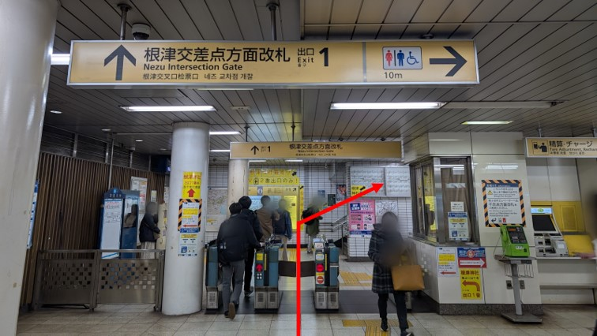
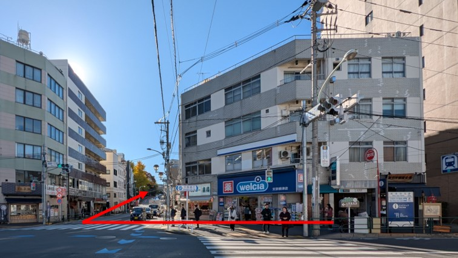
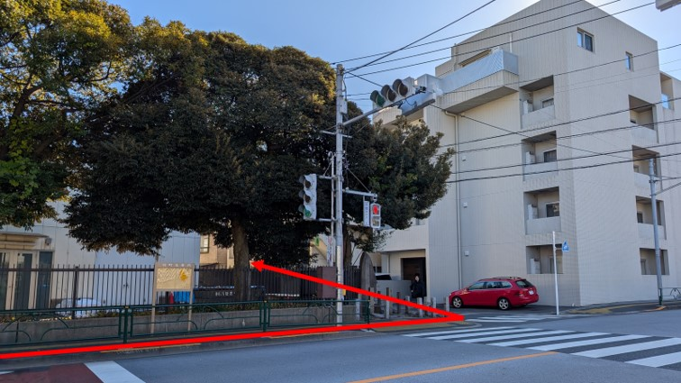
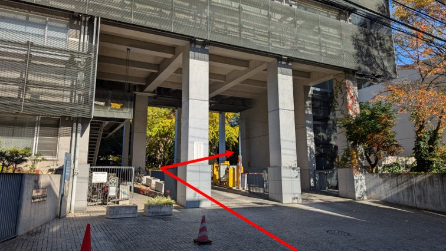
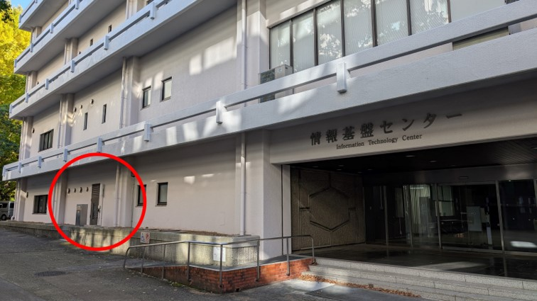

# 概要

下記の要綱にて Julia in Physics 2024 を開催します. 皆様のご参加をお待ちしております.

| **日時**     | 2024年12月14日(土) 13:00 - 19:00 |
| **開催方式** | 対面 / Zoom ハイブリット |
| **会場**     | [東京大学 本郷地区キャンパス(浅野キャンパス) 情報基盤センター(本館) 214](#アクセス) |
| **最寄り駅** | 根津駅（千代田線） |
| **申し込み** | [https://forms.gle/WTiyPtf97Q2LcDA59](https://forms.gle/WTiyPtf97Q2LcDA59) |

# プログラム

プログラムは予告なく変更される可能性があります. 

| **12:45 -**       | 開場, ※開場前は施錠されているため建物には入れません |
| **13:00 - 13:10** | 開会のあいさつ, 諸連絡 |
| **13:10 - 14:10** | [招待講演１](#招待講演１)（数値計算）|
|                   | 休憩 |
| **14:20 - 15:20** | [招待講演２](#招待講演２)（HPC） |
|                   | 休憩, 集合写真 |
| **15:40 - 16:40** | [招待講演３](#招待講演３)（テンソルネットワーク）|
|                   | 休憩 |
| **16:50 - 17:05** | [一般講演１](#一般講演１)（流体力学） |
| **17:05 - 17:30** | [一般講演２](#一般講演２)（格子QCD） |
|                   | 休憩 |
| **17:40 - 18:05** | [一般講演３](#一般講演３)（変分法） |
| **18:05 - 18:30** | [一般講演４](#一般講演４)（格子QCD） |
| **18:30 - 18:40** | 閉会のあいさつ |
| **19:00 -**       | 懇親会 |

## 招待講演１

| **題目** | Juliaによる数値計算入門 |
| **氏名** | 永井 佑紀 |
| **所属** | 東京大学 情報基盤センター |
| **概要** | 数値計算に使う言語としてのJulia言語の紹介と、その特徴について述べる。また、連立方程式、固有値問題、常微分方程式などの計算アルゴリズムについて、実際のコードを紹介しつつ、簡単に紹介する。この数値計算入門によって、「なぜJuliaがよいのか」ということを理解してもらえると幸いである。 参考文献：永井佑紀「Juliaではじめる数値計算入門」技術評論社 (2024) |

## 招待講演２

| **題目** | Productivity meets performance: Julia for HPC |
| **氏名** | Valentin Churavy |
| **所属** | Johannes-Gutenberg University Mainz & University of Augsburg |
| **概要** | Julia is a flexible, friendly, fast programming language for scientific (and beyond) computations. This talk will discuss benefits and challenges of using Julia in HPC, particularly on  Fujitsu A64FX ARM-based processors. The flexibility of Julia makes it particularly well-suited to take advantage of the interesting combination of hardware features of A64fx, such as Scalable Vector Extension (SVE), and native support for reduced-precision floating-point arithmetic. I will discuss the compilation pipeline using  a performance study, demonstrating that Julia can match the performance of tuned libraries. |

## 招待講演３

| **題目** | 関数のテンソルトレイン表現をjuliaで入門 |
| **氏名** | 櫻井 理人 |
| **所属** | 日本学術振興会特別研究員PD 東京大学大学院理学系研究科藤堂研究室 |
| **概要** | テンソルネットワークはもともと量子状態の圧縮のために発展してきたが、応用数学の分野では幅広い関数系の圧縮へ応用されている。ここでは応用数学で発展した圧縮技術であるTensorCrossInterpolationに焦点を当て、Juliaで開発された[TensorCrossInterpolation.jl](https://github.com/tensor4all/TensorCrossInterpolation.jl)を扱う。TensorCrossInterpolation.jlとITensors.jlの使い方のデモを交えつつ、関数のテンソルトレイン表現と演算、その応用例についても触れる。 |

## 一般講演１

| **題目** | 3D-BOS法による流体密度場の3次元再構成コードのJuliaでの開発 |
| **氏名** | 赤嶺　政仁 |
| **所属** | 東京大学大学院 工学系研究科 航空宇宙工学専攻 講師 |
| **概要** | 超音速乱流ジェットなどの複雑な流体現象を、３次元・非接触で計測できる「3D-BOS法」のためのコード開発をJuliaで進めている。CUDA.jlでの高速化なども行っているので、その事例を紹介したい。（https://doi.org/10.1007/s00348-023-03672-1 で既報の内容を含む。コードはhttps://github.com/wavepackets/SchlierenReconstructions.jl で公開準備中） |

## 一般講演２

| **題目** | Machine Learning Estimation on the Trace of Inverse Dirac Operator using the Gradient Boosting Decision Tree Regression |
| **氏名** | Benjamin J. Choi |
| **所属** | 筑波大学計算科学研究センター |
| **概要** | We present our preliminary results on the machine learning estimation of $\mathrm{Tr}~M^{-n}$ from other observables with the gradient boosting decision tree regression, where $M$ is the Dirac operator. Ordinarily, $\mathrm{Tr}~M^{-n}$ is obtained by linear CG solver for stochastic sources which needs considerable computational cost. Hence, we explore the possibility of cost reduction on the trace estimation by the adoption of gradient boosting decision tree algorithm. We also discuss effects of bias and its correction. |

## 一般講演３

| **題目** | Juliaではじめる変分法 |
| **氏名** | 大野 周平 |
| **所属** | 横浜市大学大学院 生命ナノシステム科学研究科 物質システム科学専攻 量子物理化学研究室 D2 理化学研究所 仁科加速器研究センター 少数多体系物理研究室 大学院生リサーチ・アソシエイト（JRA） |
| **概要** | J.M.ティッセン著『計算物理学』(丸善出版, 2012)の第3章を参考に, Schrödinger方程式に対する変分法について解説する. ガウス型基底関数による水素原子の変分計算を演習形式で解説し, Juliaによる実装を例示する. 実用的な例として[TwoBody.jl](https://ohno.github.io/TwoBody.jl/)によるクォーク模型（チャーモニウムの質量）の計算を実演し, 最後に三体系以上への拡張に向けた課題と展望を述べる. |

## 一般講演４

| **題目** | Juliaではじめる格子QCD |
| **氏名** | 富谷 昭夫 |
| **所属** | 現代教養学部 数理科学科 情報数理科学専攻 専任講師 |
| **概要** | Julia言語は開発と計算時間のバランスが良い、計算物理に研究に最適な言語であると言える。他方、格子QCDは強結合量子多体系と似た仕組みで定式化し、場の量子論の計算を統計力学と似た仕組みで計算する理論である。本講演では、格子QCDの計算をJulia言語で実装した LatticeQCD.jl や JuliaQCD を紹介し、デモンストレーションを行う。 |

# 参加登録

[こちらのフォーム](https://forms.gle/WTiyPtf97Q2LcDA59)よりご登録ください.

# アクセス

最寄り駅は **根津駅 (千代田線)** です. **情報基盤センター(本館) 214** までお越しください.

<iframe src="https://www.google.com/maps/embed?pb=!1m18!1m12!1m3!1d3239.4161578803523!2d139.76245279855846!3d35.71598244584945!2m3!1f0!2f0!3f0!3m2!1i1024!2i768!4f13.1!3m3!1m2!1s0x60188c2e4e11be15%3A0xdfb3af990c344d7d!2z44CSMTEzLTAwMzIg5p2x5Lqs6YO95paH5Lqs5Yy65byl55Sf77yS5LiB55uu77yR77yRIOaDheWgseWfuuebpOOCu-ODs-OCv-ODvCjmnKzppKgp!5e0!3m2!1sja!2sjp!4v1731924110887!5m2!1sja!2sjp" width="600" height="450" style="border:0;" allowfullscreen="" loading="lazy" referrerpolicy="no-referrer-when-downgrade"></iframe>

# 道案内

|  | 根津駅の根津交差点方面改札から出て階段を上ります. |
|  | 出口1番を出て右手の坂を上ってください. |
|  | 左側に「弥生式土器ゆかりの地」碑が見えますので, 左に曲がります.  |
|  | 門を入って右に曲がります. |
|  | 情報基盤センターの小さいドアからお入りください. 2階の214室が会場です. |

# 当日レポート

Xのハッシュタグは[`#JuliaInPhysics2024`](https://twitter.com/hashtag/JuliaInPhysics2024)です. https://x.com/hashtag/JuliaInPhysics2024 よりご覧ください.

# アンケート

総計179名の参加登録がありました. 登録時の事前アンケートの集計結果を公開します.

## 所属　 Affiliation

| 機関種別 | 登録数 |
| :--- | :--- |
| 国内大学・大学院 | 140 |
| 国内研究機関 | 16 |
| 海外大学・大学院 | 5 |
| 海外研究機関 | 3 |
| 民間企業 | 9 |
| その他 | 6 |

## 職位・学年　Job Title

| 区分 | 登録数 |
| :--- | :--- |
| 学部生 | 27 |
| 修士 | 30 |
| 博士 | 25 |
| ポスドク | 19 |
| 助教・助教 | 16 |
| 特任講師・講師 | 4 |
| 特任准教授・准教授 | 23 |
| 教授 | 9 |
| 研究員 | 9 |
| 主任研究員 | 5 |
| その他 | 12 |

## 宣伝について　 Promotion

どこでこのイベントを知りましたか？ 全てご選択ください.

| 情報源 | 登録数 |
| :--- | :--- |
| X（旧Twitter）のポスト | 76 |
| メーリングリスト | 53 |
| 知り合いから紹介された | 23 |
| 指導教員から紹介された | 17 |
| 世話人から紹介された | 15 |
| 世話人本人 | 4 |
| Discord - JuliaLangJa | 3 |
| 学習物理学のHP | 2 |
| Julia Advent Calendar 2024 | 2 |

## 過去に参加したイベント　Past Events

過去に参加したイベントについて全てチェックを入れてください.

| イベント | 登録数 |
| :--- | :--- |
| 2021/09/03(金) - 03(金)  Julia in Physics 2021 Online | 17 |
| 2023/03/13(月) - 15(水) 計算物理 春の学校 2023 | 15 |
| 2023/07/10(月) - 12(水)  研究会『数学と物理におけるJuliaの活用』 | 17 |
| 2024/02/03(土) - 03(土)  JuliaTokyo #11 | 7 |
| 2024/03/11(月) - 15(金)  計算物理 春の学校 2024 | 37 |
| 2024/08/31(土) - 31(土)  JuliaTokyo #12 | 5 |
| 2024/11/24(日) - 24(日)  研究会『2024年ノーベル物理学賞、ノーベル化学賞、AIで自然科学はどう変わったのか、どう変わるのか』 | 24 |
| 2025/03/10(月) - 14(金)  計算物理春の学校 2025 (予定) | 28 |
| 特になし | 41 |

## 利用歴　Years of Experience

Juliaを使い始めた時期についてご回答ください.

| 開始時期 | 登録数 |
| :--- | :--- |
| 2018年よりも前から（ - v1.0.0 ） | 16 |
| 2018年頃から（v1.0.0 - ） | 4 |
| 2019年頃から（v1.1.0 - v1.3.1） | 6 |
| 2020年頃から（v1.4.0 - v1.5.3） | 5 |
| 2021年頃から（v1.5.4 - v1.7.1） | 16 |
| 2022年頃から（v1.7.2 - v1.8.4） | 17 |
| 2023年頃から（v1.8.5 - v1.10.0） | 22 |
| 2024年頃から（v1.10.1 - ） | 32 |
| まだ始めていない | 60 |

## Juliaを始めたきっかけ　Trigger

Juliaを始めたきっかけについて全て選択してください.

| きっかけ | 登録数 |
| :--- | :--- |
| X（旧Twitter）などで目にしたから | 49 |
| 研究室で教わった | 18 |
| 指導教員に勧められたから | 15 |
| 共同研究者に勧められたから | 14 |
| 知り合いに勧められたから | 38 |
| まだ始めていない | 54 |

その他：
- 開発に関わっているから
- 計算物理春の学校にて
- Fortranが自分のPC環境で期待通り動かずたどり着いた
- 数値計算に使える言語をweb上で検索していて発見した
- 多倍長精度数値計算がjuliaではデフォルトで利用できるため
- 正確に覚えていない
- 偶然ネットで見つけてから
- ネットで見つけた
- Julia in Physics 2021 Online に参加したから

## 使用目的　Purpose

Juliaを使用する・使用した目的について全て選択してください.

| 目的 | 登録数 |
| :--- | :--- |
| 卒論のため | 21 |
| 修論のため | 23 |
| 博論のため | 12 |
| 研究のため | 103 |
| 研究以外の仕事のため | 21 |
| TAのため | 0 |
| 研究指導のため | 8 |
| 趣味 | 64 |
| 使ってみたいパッケージがあったから | 14 |
| まだ始めていない | 35 |

その他：
- 現時点ではmathematicaとwxmaximaを研究で利用しているが，将来的に julia も利用したい。
- 学部実験の解析と計算物理の授業の課題

## 活用事例　Use Cases

Juliaを活用した事例についての記事や学術論文のURLを改行区切りでご記入ください.

- [https://tensor4all.org](https://tensor4all.org)
- [https://github.com/tensor4all/TensorCrossInterpolation.jl](https://github.com/tensor4all/TensorCrossInterpolation.jl)
- [https://github.com/SpM-lab/SparseIR.jl](https://github.com/SpM-lab/SparseIR.jl)
- [https://github.com/KskAdch/TopologicalNumbers.jl](https://github.com/KskAdch/TopologicalNumbers.jl)
- [https://journals.aps.org/prb/abstract/10.1103/PhysRevB.110.035303](https://journals.aps.org/prb/abstract/10.1103/PhysRevB.110.035303)
- [https://www.nature.com/articles/s41563-024-02034-4](https://www.nature.com/articles/s41563-024-02034-4)
- [https://arxiv.org/abs/2410.07767](https://arxiv.org/abs/2410.07767)
- [https://arxiv.org/abs/2312.15615](https://arxiv.org/abs/2312.15615)
- [https://journals.aps.org/prresearch/abstract/10.1103/PhysRevResearch.5.043171](https://journals.aps.org/prresearch/abstract/10.1103/PhysRevResearch.5.043171)
- [https://doi.org/10.1103/PhysRevResearch.6.013090](https://doi.org/10.1103/PhysRevResearch.6.013090)
- [https://iopscience.iop.org/article/10.1088/1873-7005/acdff7](https://iopscience.iop.org/article/10.1088/1873-7005/acdff7)
- [https://qiita.com/Dolphin7473/items/7fb97931cc877b61b89b](https://qiita.com/Dolphin7473/items/7fb97931cc877b61b89b)
- [https://qiita.com/Dolphin7473/items/7a76367a0967e85d376f](https://qiita.com/Dolphin7473/items/7a76367a0967e85d376f)
- [https://arxiv.org/abs/2411.18170](https://arxiv.org/abs/2411.18170)
- [http://id.nii.ac.jp/1001/00232256/](http://id.nii.ac.jp/1001/00232256/)
- [https://doi.org/10.1103/PhysRevLett.130.247102](https://doi.org/10.1103/PhysRevLett.130.247102)
- [https://shimizudan.github.io/20240831juliatokyo/](https://shimizudan.github.io/20240831juliatokyo/)
- [https://github.com/aviatesk/JET.jl](https://github.com/aviatesk/JET.jl)
- [https://arxiv.org/abs/2411.14812](https://arxiv.org/abs/2411.14812)
- [https://doi.org/10.1007/JHEP07(2024)033](https://doi.org/10.1007/JHEP07(2024)033)
- [https://github.com/yano404/CoupledChannelMethod](https://github.com/yano404/CoupledChannelMethod)
- [https://doi.org/10.1007/s00601-024-01900-w](https://doi.org/10.1007/s00601-024-01900-w)
- [https://doi.org/10.1103/PhysRevD.110.014020](https://doi.org/10.1103/PhysRevD.110.014020)
- [https://github.com/machakann/DoubleExponentialFormulas.jl](https://github.com/machakann/DoubleExponentialFormulas.jl)
- [https://gitlab.com/mnkmr/ParticleTrajectorySimulationsCore.jl](https://gitlab.com/mnkmr/ParticleTrajectorySimulationsCore.jl)
- [https://gitlab.com/mnkmr/PBasexInversion.jl](https://gitlab.com/mnkmr/PBasexInversion.jl)
- [https://doi.org/10.21105/jcon.00068](https://doi.org/10.21105/jcon.00068)
- [https://juliarheology.github.io/RHEOS.jl/stable/](https://juliarheology.github.io/RHEOS.jl/stable/)
- [https://doi.org/10.1093/ptep/ptae109](https://doi.org/10.1093/ptep/ptae109)
- [https://doi.org/10.1093/ptep/pty088](https://doi.org/10.1093/ptep/pty088)
- [https://doi.org/10.1007/JHEP12(2018)045](https://doi.org/10.1007/JHEP12(2018)045)
- [https://doi.org/10.1093/ptep/ptz107](https://doi.org/10.1093/ptep/ptz107)
- [https://doi.org/10.22323/1.363.0145](https://doi.org/10.22323/1.363.0145)
- [http://hdl.handle.net/2324/4474929](http://hdl.handle.net/2324/4474929)
- [https://speakerdeck.com/hsugawa8651/julia-a-fresh-programming-language-for-freshmen-in-japanese](https://speakerdeck.com/hsugawa8651/julia-a-fresh-programming-language-for-freshmen-in-japanese)
- [https://juliapackages.com/p/extendedkronigpennymatrix](https://juliapackages.com/p/extendedkronigpennymatrix)
- [https://doi.org/10.1007/s00348-023-03672-1](https://doi.org/10.1007/s00348-023-03672-1)
- [https://doi.org/10.2514/6.2024-2101](https://doi.org/10.2514/6.2024-2101)
- [https://arxiv.org/abs/2405.06440](https://arxiv.org/abs/2405.06440)
- [https://github.com/hydrocoast/VisClaw.jl](https://github.com/hydrocoast/VisClaw.jl)
- [https://github.com/hydrocoast/CoordinateConverterGK.jl](https://github.com/hydrocoast/CoordinateConverterGK.jl)
- [https://qiita.com/hydrocoast/items/75c52f373eda734a3833](https://qiita.com/hydrocoast/items/75c52f373eda734a3833)
- [https://doi.org/10.1103/PhysRevB.109.224410](https://doi.org/10.1103/PhysRevB.109.224410)

## 利用パッケージ　Frequently Using Packages

よく利用するパッケージ名を改行区切りでご記入ください.

| パッケージ名              | 登録数 |
| :----------------------- | :---- |
| LinearAlgebra.jl         | 35    |
| Plots.jl                 | 22    |
| ITensors.jl              | 7     |
| Makie.jl / CairoMakie.jl | 6 / 3 |
| DataFrames.jl            | 5     |
| Optim.jl                 | 5     |
| PyPlot.jl                | 5     |
| Statistics.jl            | 5     |
| BenchmarkTools.jl        | 4     |
| CSV.jl                   | 4     |
| Flux.jl                  | 4     |
| Gaugefields.jl           | 4     |
| JLD2.jl                  | 4     |
| LsqFit.jl                | 4     |
| Revise.jl                | 4     |

- 登録数 3 DifferentialEquations.jl, Distributed.jl, FFTW.jl, LaTeXStrings.jl, SpecialFunctions.jl, StaticArrays.jl
- 登録数 2 Test.jl, ITensorMPS.jl, JET.jl, Graphs.jl, Lux.jl, SparseIR.jl, PythonPlot.jl, MPI.jl, QuadGK.jl, HDF5.jl, Random.jl, Unitful.jl, LatticeQCD.jl
- 登録数 1 TerminalPager.jl, FastTransform.jl, CUDA.jl, Cthulhu.jl, Accessors.jl, OrdinaryDiffEq.jl, IJulia.jl, Primes.jl, Combinatorics., Infiltrator.jl, Associations.jl, GLM.jl, Yao.jl, PhysicalConstants.jl, Enzyme.jl, DataStructures.jl, ProgressBars.jl, IterTools.jl, FLoops.jl, Dates.jl, SharedArrays.jl, Debugger.jl, SQLite.jl, JuliaFormatter.jl, SymPy.jl, LanguageServer.jl, GMT.jl, DelimitedFiles.jl, Optimization.jl, Zygote.jl, Oxygen.jl, AbstractAlgebra.jl, Pkg.jl, LightGBM.jl, Pluto.jl, BioSequences.jl, Printf.jl, ArgParse.jl, ProgressMeter.jl, Distributions.jl, ComponentArrays.jl, Documented.jl, QuanticsTCI.jl, Measurements.jl, Formatting.jl, Missings.jl, SparseArrays.jl, MLJ.jl, GaussianProcesses.jl, Documenter.jl, GeneriLinearAlgebra, Nemo.jl, StatsBase.jl, NeuralPDE.jl, TensorCrossInterpolation.jl, OffsetArrays.jl, GLMakie.jl, OhMyREPL.jl, Wilsonloop.jl, Gnuplot.jl, DynamicalSystems.jl, LibSndFile.jl |

## Juliaに期待すること　Requests

Juliaに期待することがあればご記入ください.

- 高速な量子コンピューティングエミュレーション
- CFD（数値流体力学）界隈での認知度をあげたい．どのスパコンにもJuliaがインストールされていてほしい
- 重力波等の数値計算
- 第一原理（電子状態・熱輸送）の数値解法を作りたく、部分部分を検討しています
- シンボリックな数式処理など
- MATLABとたたかっていくこと
- シンボリック計算 (MathematicaのSolve)
- 自由境界値問題を計算するためのソルバー，それを簡単に可視化するツール
- アクセラレータ対応、必要ならホストデバイス間での明示的データコピーを手で書いてでも
- コミュニティの規模を大きくする。より良いデベロッパーツールの開発
- デフォルトでbigfloatが利用できるため，多倍長精度数値計算がより一般的に広がって欲しい．
- Fortranに代わる計算科学プログラミングとして
- 量子多体系のモンテカルロ計算、特にGPU上で加速するコードを作成したい。
- 量子多体系（スピン、ボソン、フェルミオン）のあまり重くないシミュレーションが手軽にできるパッケージ、リー代数やC*代数の計算（既約表現を求めたり、代数上での最適化など）ができるパッケージ
- 量子コンピュータで簡単な物理計算ができること。
- 偏微分方程式を解くことを専門としたパッケージがほしい
- より高機能な言語サーバー
- Pythonには仮想環境とパッケージの管理を一括して行えるRyeというツールがあり、容易に開発環境を別のコンピュータに移すことができる。Juliaの仮想環境ツールももう少し機能を充実させて同じことができると嬉しい。
- ITensorでＴＴ形式の微分方程式が解けるとかなり楽
- 量子化学計算のパッケージを作りたい,  分子軌道の可視化パッケージがほしい
- 量子多体系の有限温度計算の手法を知ること
- 計算時間の短縮

## Juliaでの困りごと　Problems

Juliaについて困っていることがあればできるだけ詳細にご記入ください.

- MPIを使用したファイルをjulia ~.jlで実行するとエラー（shmem: mmap: an error occurred while determining whether or not）が出ます。この解決方法について知りたいです。
- 個人開発で暫く手を触れないと、野良パッケージのCIが通らなくなり方式も変わって修正方法を探るのが大変。結果、メンテが疎かになりがち（自分のせいではあるのでしょうがないが）。
- 機械学習に関する記事が少ない
- （どの言語でも同じだと思いますが）最新バージョンで導入された機能をキャッチアップしづらい
- Qiitaなどで公開されている記事が古いことがある。乱数に仕様が変わったことが反映されていないなど。また、パッケージがメンテされていないものが目立つように感じている。
- 周りにユーザーが少ない上、参考になる記事・文献も少ない。
- ユーザーが増えてほしい！！！
- Juliaのコード内で律速になっている部分を見つけたいが、Profile.jlの実行結果の見かたがよく分からない。
- VSCodeなどのIDEでJuliaのREPLのような編集(ギリシャ文字の入力など)をしたい
- 並列化がc++などに比べてわかりにくい
- constやparameterなどの便利なツールを体系的に教えて欲しい。
- デバッグのやり方がよくわからない。
- 富岳での処理系のビルドが難しい
- エディターサポートがイケてない
- Juliaのライブラリーがc言語などのwrapperの場合，一般にbigfloatを利用できないので純Juliaのライブラリーが普及すると良いなと思います．
- 変数のスコープ、複素数がからむ自動微分で手間取ることがある。
- パッケージのバージョンが上がって、関数がなくなる、ファイルが読み込めなくなる等が頻発する
- 富岳上での富士通コンパイラによるbuildが失敗する
- 学生にスクリプトを書かせると，型の違いで実行できないことがよくある．このあたりの理解が必要な点が（octaveなどに比べ）難しい．
- バージョンによって文法が変わること
- MPI
- 型・メモリ安全性、メモリ効率化の不透明さ
- 仕様変更
- パッケージ作成の手順が煩雑すぎるのでGitHubのテンプレート機能で簡単に作れるようにしてほしい
- 多重ディスパッチで定義された関数のうち、実際にコードの中で走っているものがどれかを特定するのが難しい
- Static compileしてC-APIの共有ライブラリが作れることを期待してます
- TensorsにおいてMPSの生成について困ることが多い
- また、物理量の測定をするときにその測定した値を保存したり、フーリエ変換をする際にデータ処理の仕方にまだ慣れず困ることが多い
- どのようにデータ保存をしたり、それを処理するときの方法論についてCSVを使い始めたあたりでまだわからないことだらけ
- Dict型とかも初歩的だけどまだ理解度は低い
- Juliaは高速だと聞いていたが、同じプログラムをPython(あるいはNumPy)で組んだ方が速かった。インストール等の手間を含め、メリットが見えない。
- コーディングが悪いと実行速度がかなり遅くなる
- 並列計算を習得したいが、どこで学べるのかがよくわかっていない。
- Fortranと比較したさいの計算時間の増加

# お問い合せ

[こちらのフォーム](https://forms.gle/WTiyPtf97Q2LcDA59)に記載のメールアドレスよりご連絡ください.

# リンク

Julia言語について

- [Julia公式サイト](https://julialang.org/)
- [なぜ僕らはJuliaを作ったか](https://www.geidai.ac.jp/~marui/julialang/why_we_created_julia/index.html)

関連イベント

- [Julia in Physics 2021 Online](https://akio-tomiya.github.io/julia_in_physics/)
- [数学と物理におけるJuliaの活用](https://akio-tomiya.github.io/julia_imi_workshop2023/)

世話人（順不同）

- 大野 周平（横浜市立大学, 理化学研究所）
- 富谷 昭夫（東京女子大学）
- 永井 佑紀（東京大学）
- 大野 浩史（筑波大学）

本研究会は[科学研究費補助金学術変革領域研究(A)「学習物理学の創成」](https://mlphys.scphys.kyoto-u.ac.jp/)の支援を受けた.
